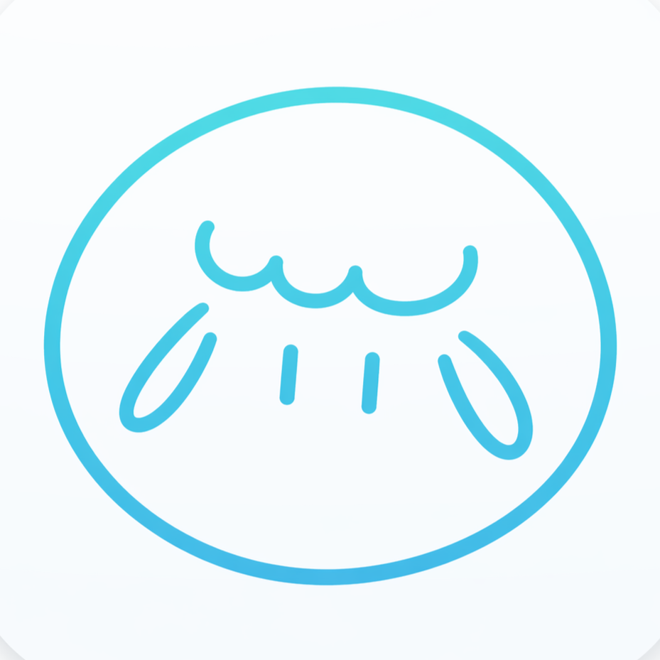

<div align="center">



# 眠羊 SleepBaa

<p><strong>和舍友住在一起，也能好好睡一觉。</strong></p>

面向大学宿舍的智能睡眠助手<br />
从睡前判断、夜间陪伴，到晨间复盘与寝室协同

<sub>Flutter · CloudBase · Node.js 20 · AI Sleep Agent</sub>

<br /><br />

[产品体验](#product)　[演示视频](#video)　[技术实现](#technology)　[本地运行](#run)　[团队](#team)　[使用许可](#license)

</div>

<br />

<div align="center">

</div>

<br />

> 眠羊是天津大学多姆斯利普团队完成的学生创新项目。我们从 1500 余份问卷出发，把睡眠问题放回宿舍这个真实环境中处理。

| 调研样本 | 宿舍环境影响 | 项目成果 |
| :--: | :--: | :--: |
| 1500+ 份问卷 | 60.71% 的受访同学至少偶尔受到影响 | 5 项奖项 · 1 次参展 |

---

## 从一个很普通的夜晚说起

23 点 40 分，已经想睡了，手机还没放下。零点过后，舍友仍在说话、开灯、走动。明早有课，时间越晚，人越清醒。

这类问题很难只靠一份睡眠报告解决。宿舍里的噪声、灯光、手机使用、情绪压力和舍友作息会同时出现，许多时候还牵涉一件更难的事，那就是该怎么开口。

调研中，60.71% 的同学表示自己至少偶尔受到宿舍环境影响。受访者对个性化微干预建议和 AI 助手陪伴的接受度均超过 4 分，满分为 5 分。这些结果决定了眠羊最初的产品方向。

<div align="center">

</div>

---

<a id="product"></a>

## 眠羊怎样陪你过完一晚

眠羊先判断今晚最主要的干扰，再给出少量、当下就能完成的建议。夜间尽量减少操作，晨间根据反馈继续调整。遇到共居问题时，寝室协同功能会帮助成员共享状态、约定规则和发送更自然的提醒。

<div align="center">

</div>

| 阶段 | 眠羊会做什么 | 用户得到什么 |
| :-- | :-- | :-- |
| 睡前 | 结合噪声、灯光、手机使用和情绪状态判断干扰 | 一到两项可以马上执行的建议 |
| 睡眠中 | 提供放松音频、呼吸引导、夜醒速记和锁屏提醒 | 更少的操作与打断 |
| 睡醒后 | 收集晨间反馈，生成睡眠报告与本周快照 | 看清变化，并调整下一晚的建议 |
| 寝室共居 | 共享状态、共同制定公约、发送委婉提醒 | 降低沟通成本，减少作息冲突 |

### 睡前判断

用户只需补充几项当晚状态，小眠会判断影响入睡的主要因素。建议会控制数量，重点是今晚能做，而非泛泛地讲一遍睡眠常识。

<div align="center">

</div>

### 夜间陪伴

进入睡眠模式后，界面会主动收敛。放松音乐、呼吸引导、夜醒记录和常驻通知都围绕低打扰设计，临时闪过的梦或待办也能快速记下。

<div align="center">

</div>

### 晨间复盘

起床后的反馈会进入个人睡眠记录。眠羊会整理当晚情况、展示近期变化，并把有效与无效的建议留给下一次判断。

<div align="center">

</div>

### 寝室协同

成员可以查看宿舍状态、共同约定作息，也可以让眠羊代为组织一条不那么生硬的提醒。静音等状态能够在寝室成员之间联动。

<div align="center">

</div>

### 小眠

小眠是贯穿产品流程的 AI 睡眠助手。它负责理解自然语言输入、承接情绪、解释建议，并在第二天追问效果。对话记录和结构化反馈共同用于更新后续建议。

<div align="center">

</div>

### 梦境与情绪

用户可以在醒来后快速记录梦境，也可以在睡前选择当下情绪。情绪会影响界面色彩和陪伴语气，梦境记录则保留为个人复盘材料。AI 生成的梦境内容仅作整理与参考。

<div align="center">
&nbsp;

</div>

<details>
<summary><strong>查看产品创新点</strong></summary>

<br />

<div align="center">

</div>

- 建议来自当晚的干扰因素判断，数量少，并且可以立即执行
- 宿舍作息冲突被纳入产品流程，不再只记录个人数据
- 小眠参与睡前输入、夜间陪伴与晨间反馈，保留连续上下文
- 每次反馈都会影响后续建议，让产品逐步适应个人习惯

</details>

---

<a id="video"></a>

## 82 秒了解眠羊

<div align="center">

<video src="video/video.mp4" poster="docs/readme/ui-overview.jpg" controls="controls" width="90%"></video>

若当前页面无法显示播放器，可[直接观看或下载宣传视频](video/video.mp4)。视频含音效。

</div>

---

<a id="technology"></a>

## 技术实现

客户端使用 Flutter 开发，后端运行在腾讯云 CloudBase。登录、数据同步、AI 对话和音频服务通过统一的 HTTP API 接入，AI 回复使用 SSE 流式传输。

<div align="center">

</div>

| 层级 | 技术与职责 |
| :-- | :-- |
| 客户端 | Flutter、Dart SDK 3.11.4、Material Design，Android minSdk 23 |
| 云端 | 腾讯云 CloudBase、HTTP 云函数、事件触发函数、云数据库、云存储、身份认证 |
| AI | CloudBase AI 大模型、SSE 流式对话、可配置 Provider 与降级处理 |
| 后端运行时 | Node.js 20、TypeScript |

项目目录、数据流、云函数和构建说明见 [ARCHITECTURE.md](ARCHITECTURE.md)。

> 眠羊目前是产品原型与学生创新项目，不能替代医生、心理咨询师或其他专业人员的诊断与建议。

---

<a id="run"></a>

## 本地运行

### 体验界面与本地流程

无需云端配置。客户端会使用内置的内存后端，适合查看界面和基本交互。

```powershell
flutter pub get
flutter build apk --no-tree-shake-icons
```

构建产物位于 `build/app/outputs/flutter-apk/app-release.apk`。

### 连接 CloudBase

完整模式依赖 CloudBase 登录、数据同步、AI 对话和云端音频。仓库仅提供配置模板 [.cloudbase.local.example.json](.cloudbase.local.example.json)，以下内容不会提交到公开仓库。

- CloudBase PublishableKey、云账号凭据与 `.cloudbase.local.json`
- Android 正式签名证书，包括 `key.properties`、`*.jks` 和 `*.keystore`
- 大模型 API Key 与云端助眠音频

如需用于评审、研究复现或合作开发，请通过仓库 Issues 联系团队。Windows 环境下建议把仓库放在纯英文路径中，避免 Flutter 与 Android 构建工具出现路径兼容问题。

---

## 项目经历

| 时间 | 赛事或活动 | 结果 | 主办方 |
| :-- | :-- | :-- | :-- |
| 2026.07 | 第三届中国高校计算机大赛 AIGC 创新赛，应用赛道华北赛区 | 赛区三等奖 | 中国高校计算机大赛 AIGC 创新赛组委会 |
| 2026.05 | 第十九届中国大学生计算机设计大赛天津市级赛 | 省级三等奖 | 天津市级赛组委会 |
| 2026.05 | 天津大学“盈趣科技”杯“人工智能+”创新应用案例，学生赛道 | 二等奖 | 天津大学 |
| 2026.05 | 首届天津大学新媒体与传播学院 AI 创意实践挑战赛 | 一等奖 | 天津大学新媒体与传播学院 |
| 2026.05 | 首届天津大学新媒体与传播学院 AI 创意实践挑战赛 | 优秀奖 | 天津大学新媒体与传播学院 |
| 2026 | 世界智能产业博览会智能创新黑客松 | 参展 | 世界智能产业博览会 |

---

<a id="team"></a>

## 多姆斯利普团队

<div align="center">


天津大学 · DormSleep Team
</div>

| 成员 | 主要工作 |
| :-- | :-- |
| [@zhiwuyazhe-fjr](https://github.com/zhiwuyazhe-fjr) | 产品经理、后端负责人 |
| [@GlacierXiaowei](https://github.com/GlacierXiaowei) | UI 设计、交互设计、前端负责人 |
| [@leqi-chen](https://github.com/leqi-chen) | 前端开发、创意策划 |
| [@Felix-dp](https://github.com/Felix-dp) | 后端开发、AI 集成 |

---

<a id="license"></a>

## 使用许可

本仓库的软件代码采用 [PolyForm Noncommercial License 1.0.0](LICENSE)。你可以将代码用于个人学习、研究、实验和其他非商业目的，也可以在遵守许可条款的前提下修改与分发。

任何商业用途都需要团队另行书面授权，包括将代码或其修改版本用于商业产品、付费服务、企业经营和预期商业应用。商业授权请通过仓库 Issues 联系团队。

PolyForm Noncommercial 是标准的非商业软件许可，不属于 OSI 认可的开源协议。因此，本项目更准确的表述是“源码可用”，而非“开源软件”。完整条款以 [LICENSE](LICENSE) 为准，版权声明见 [NOTICE](NOTICE)。

除非文件中另有明确说明，产品文档、界面视觉、图片、音频和视频不在上述软件代码许可范围内。“眠羊 SleepBaa”名称、产品 Logo 与团队 Logo 的商标及品牌权益由团队保留，许可文本不授予任何商标使用权。

---

<div align="center">

晚安，从宿舍开始。

<sub>© 2026 天津大学多姆斯利普团队</sub>

</div>
