<div align="center">


<br/>

**一只懂宿舍、更懂你的 AI 睡眠小羊** 🐑🌙

<br/>

[](ARCHITECTURE.md)
[](ARCHITECTURE.md)
[](ARCHITECTURE.md)
[](#agent)
[](#awards)
[](LICENSE)

[🎬 宣传视频](#video) ·
[✨ 功能亮点](#features) ·
[📱 界面一览](#ui) ·
[🏆 获奖](#awards) ·
[🚀 快速开始](#quickstart) ·
[🐑 关于我们](#team) ·
[📜 协议](#license)

</div>

---

<a id="story"></a>

## 🌃 今晚，你的宿舍几点安静下来？

> **23:40** —— 想睡了，但手机停不下来，脑子也停不下来。
> **00:20** —— 舍友还在说话、开灯、走动，环境越来越吵。
> **01:30** —— 明天早八，越想越焦虑，越想睡越睡不着。

<div align="center">
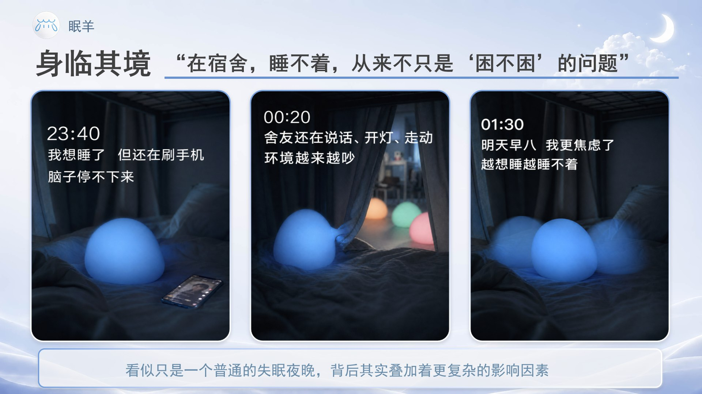
</div>

在大学生的宿舍里，**睡不着从来不只是"困不困"的问题**——它是睡前焦虑、手机刺激、噪声灯光、作息冲突层层叠加的结果。我们收集了 **1500+ 份问卷**验证过这件事：**60.71%** 的同学至少偶尔被宿舍环境影响睡眠，而"个性化微干预建议"与"AI 助手陪伴"的接受度均超过 **4 分**（满分 5 分）。

<div align="center">
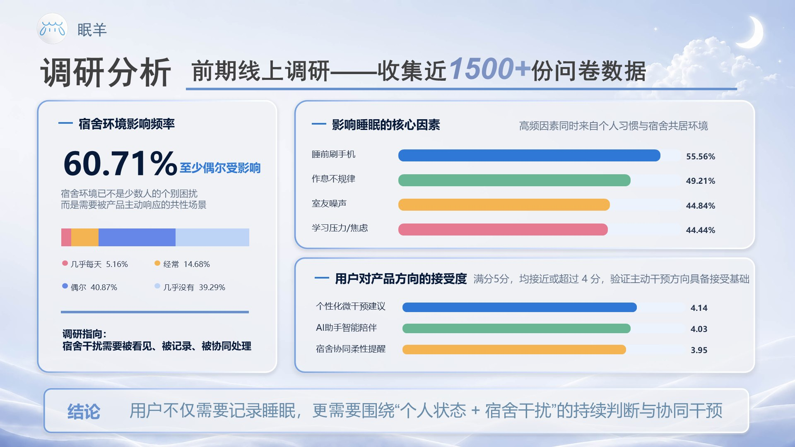
</div>

而普通睡眠 App 只负责"记录"，不负责"解决"；它们默认你独居、自律、好意思开口提醒舍友——**但宿舍不是一个人的战场**。

所以，我们做了眠羊。

---

<a id="solution"></a>

## 💡 我们做了什么

**眠羊 SleepBaa 不是"又一个助眠工具"，而是一个面向宿舍场景的智能陪伴干预系统。**

它围绕"今晚为什么睡不好"，完成 **识别问题 → 及时干预 → 持续优化** 的完整闭环：一条主线守护个人睡眠，一条支线协同整个寝室，AI 睡眠 Agent「小眠」贯穿始终。

<div align="center">
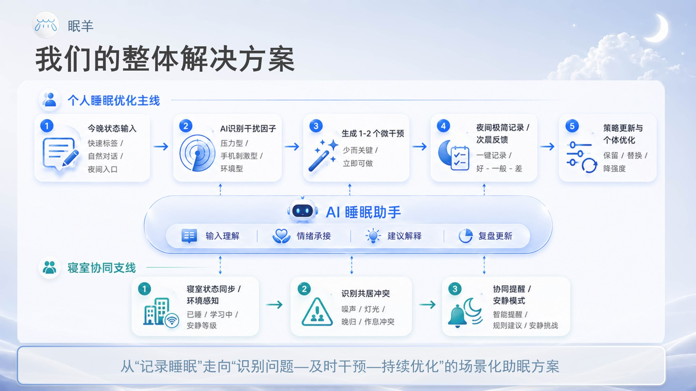
</div>

| 模块 | 关键词 | 一句话说明 |
| :-- | :-- | :-- |
| 🎯 个体干扰因子判断与微干预 | 个体化干预 | 识别今晚睡不好的主要原因，只给 1–2 个**立即可做**的关键动作 |
| 🏠 寝室互联与协同干预 | 宿舍协同 | 把作息冲突等共居问题纳入管理，提供**低冲突**的协同机制 |
| 🤖 AI 睡眠助手「小眠」 | 陪伴式 AI | 输入入口 + 情绪承接层 + 建议解释器，具有人格记忆与进化能力 |
| 🌱 长期陪伴与成长闭环 | 情绪价值 | 记录与复盘 + 激励体系，让每一次睡眠都被温柔接住 |

---

<a id="features"></a>

## ✨ 功能亮点

### 🌙 睡前 —— 先搞懂"今晚为什么睡不好"

和小眠聊两句，它便会结合宿舍噪声、灯光环境、手机使用与情绪压力，**智能归类分析干扰因子**，生成只属于你的微干预建议——少而关键，立即可做。一键进入睡眠模式，今晚交给它。

<div align="center">
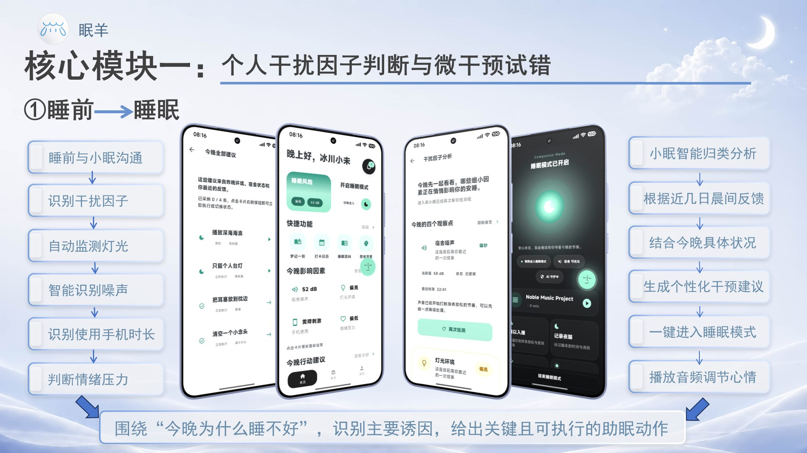
</div>

### 😴 睡眠中 —— 从"主动操作"到"低感守护"

睡眠放松音乐、难以入睡时的呼吸引导、随手记录夜醒与闪过的念头（梦记/事记，防止遗忘焦虑）、锁屏常驻通知与夜间主题 UI……**让睡眠过程被安静记录，而不是被手机打扰**。

<div align="center">
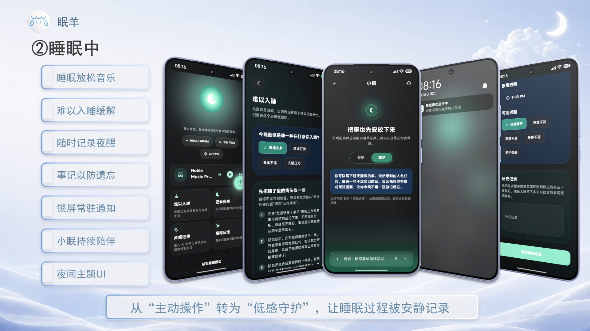
</div>

### 🌅 睡醒 —— 晨间反馈，让今晚比昨晚更好睡

梦境快速记录、晨间及时反馈、智能睡眠报告与本周睡眠快照。你的每一次反馈都会更新个人画像，**优化下一次的助眠动作**——越用越懂你。

<div align="center">
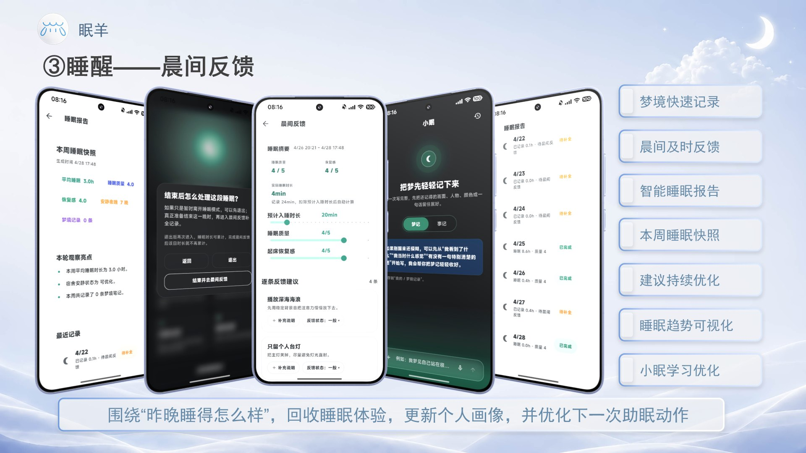
</div>

### 🏠 寝室互联 —— 把"难开口"变成"可协同"

宿舍状态一目了然、舍友动态清晰可见、宿舍公约共同制定、**"高情商"委婉提醒**替你温柔开口、静音模式智能联动……从"难开口、难协调"，变成"可感知、可提醒、可协同"。

<div align="center">
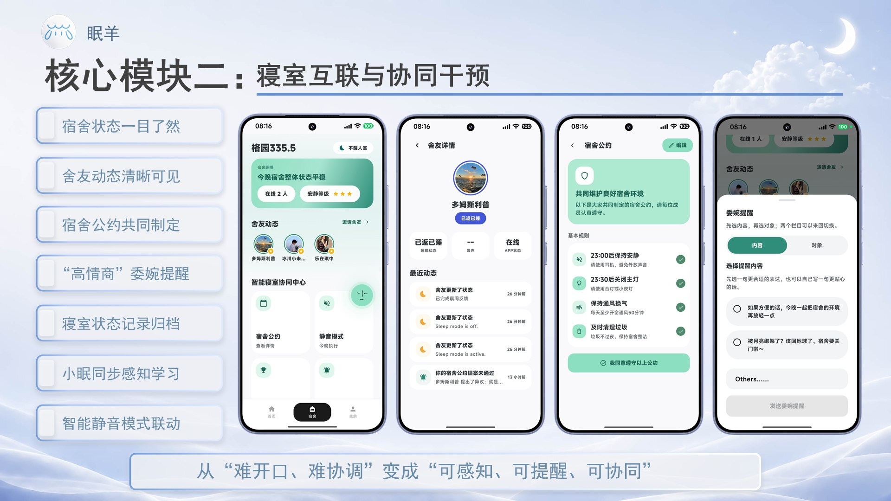
</div>

<a id="agent"></a>

### 🤖 AI 睡眠 Agent「小眠」—— 不是聊天工具，是陪伴中枢

一句话、几个标签，小眠就能快速理解今晚状态；难入睡时**先接住情绪，再进入判断与干预**；次日主动追问效果，沉淀为后续优化依据。借鉴 OpenClaw 精华架构，小眠具备**长期人格记忆、连续试错优化与自我进化能力**——它贯穿睡前、睡中、睡后的每一个瞬间。

<div align="center">
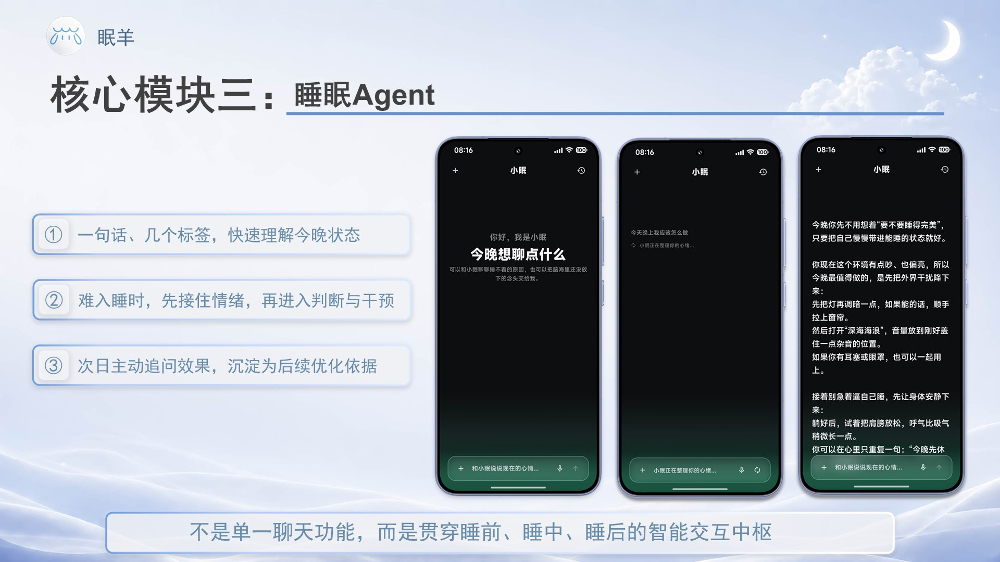
</div>

### 💭 梦境与情绪 —— 产品不仅服务睡眠，也回应情绪

睡醒后把梦轻轻记下来，小眠帮你做**梦境映射解析**；睡前选择当下心情，**整个 App 的主题、色彩与陪伴语气都会随之变化**。开心、低落、平静，每一种情绪都有自己的夜晚。

<div align="center">
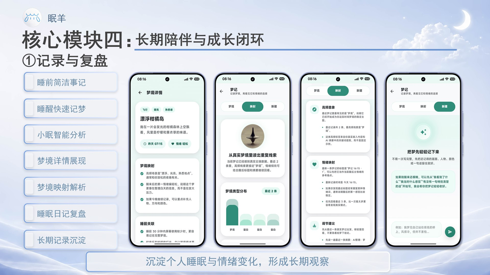 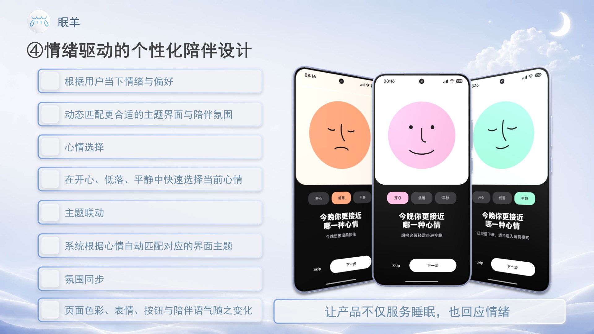
</div>

---

<a id="ui"></a>

## 📱 界面一览

首页 · 寝室页 · 我的页 · AI 助手页——四大页面，一个完整的睡眠宇宙。

<div align="center">
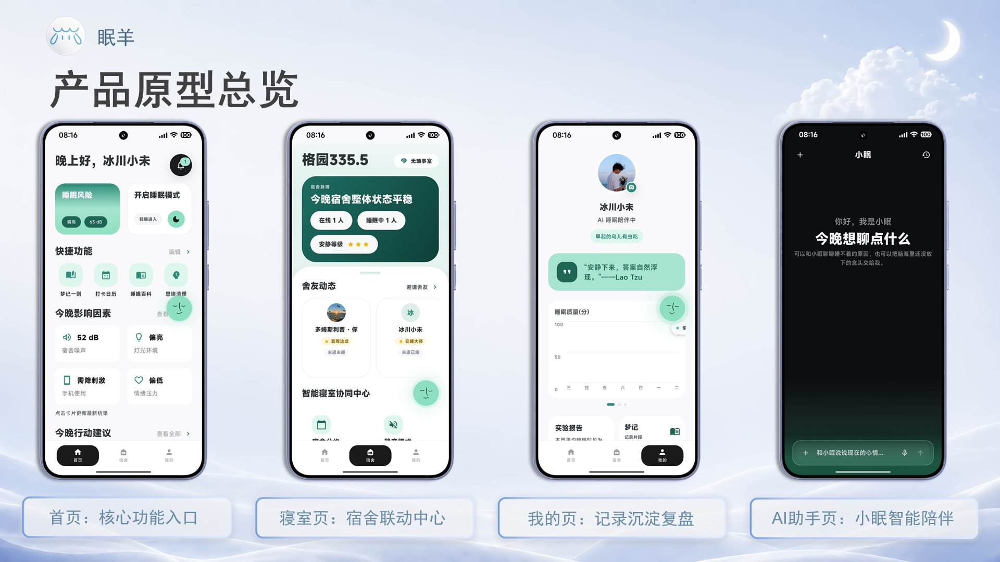
</div>

<details>
<summary>💪 <b>为什么这不是一个普通 App？</b>（点击展开创新点总结）</summary>

<br/>

<div align="center">
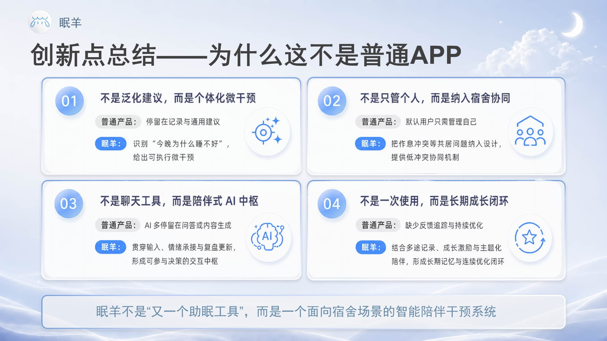
</div>

- **不是泛化建议，而是个体化微干预** —— 识别"今晚为什么睡不好"，给出可执行的关键动作；
- **不是只管个人，而是纳入宿舍协同** —— 把作息冲突等共居问题纳入设计，提供低冲突协同机制；
- **不是聊天工具，而是陪伴式 AI 中枢** —— 贯穿输入、情绪承接与复盘更新，可参与决策；
- **不是一次使用，而是长期成长闭环** —— 长期记忆 + 连续优化，越用越懂你。

</details>

---

<a id="video"></a>

## 🎬 宣传视频

<div align="center">

<video src="video/video.mp4" poster="docs/readme/ui-overview.jpg" controls="controls" width="92%"></video>

📹 若当前预览环境未显示播放器，[点击这里观看 / 下载宣传视频](video/video.mp4)（82 秒，含音效）

</div>

---

<a id="awards"></a>

## 🏆 获奖与参展

| 时间 | 赛事 / 活动 | 奖项 | 主办方 |
| :-- | :-- | :-- | :-- |
| 2026.07 | 2026 第三届中国高校计算机大赛 - AIGC 创新赛（应用赛道·华北赛区） | 🥉 赛区三等奖 | 中国高校计算机大赛 - AIGC 创新赛组委会 |
| 2026.05 | 第十九届中国大学生计算机设计大赛天津市级赛 | 🥉 省级三等奖 | 中国大学生计算机设计大赛天津市级赛组委会 |
| 2026.05 | 天津大学"盈趣科技"杯"人工智能+"创新应用案例（学生赛道） | 🥈 二等奖 | 天津大学 |
| 2026.05 | 首届天津大学新媒体与传播学院 AI 创意实践挑战赛 | 🥇 一等奖 | 天津大学新媒体与传播学院 |
| 2026.05 | 首届天津大学新媒体与传播学院 AI 创意实践挑战赛 | 🎖️ 优秀奖 | 天津大学新媒体与传播学院 |
| 2026 | 2026 年世界智能产业博览会 | 🌐 参展 | —— |

---

<a id="tech"></a>

## 🛠 技术架构

眠羊基于 **Flutter + 腾讯云 CloudBase 云开发 + 大模型能力** 完成从前端交互到智能干预反馈的全链路搭建：

<div align="center">
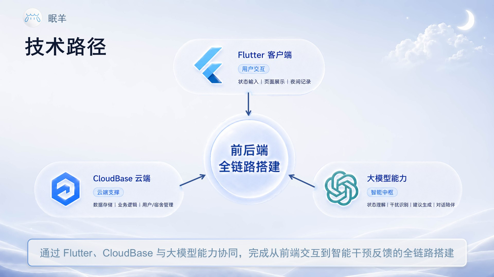
</div>

- **客户端**：Flutter（Dart SDK ^3.11.4），Material Design，Android minSdk 23；
- **云端**：[腾讯云 CloudBase 云开发](https://www.tencentcloud.com/products/tcb)——云函数（`app-api` HTTP Function + 睡眠/梦境事件触发函数）、云数据库、云存储（助眠音频托管）、身份认证；
- **AI 能力**：CloudBase AI 大模型，SSE 流式对话，Provider 工厂统一调度（可配置模型与降级兜底）；
- **后端运行时**：Node.js 20，TypeScript。

> 📖 目录结构、构建复现、云函数与大模型调用的完整说明，请阅读 **[ARCHITECTURE.md —— 架构与构建说明](ARCHITECTURE.md)**。

---

<a id="quickstart"></a>

## 🚀 快速开始

### 方式一：本地内存模式（零配置，最快体验）

无需任何云端配置，客户端会使用内置的 in-memory 本地后端，适合浏览界面与本地交互流程：

```powershell
flutter pub get
flutter build apk --no-tree-shake-icons
# 产物：build/app/outputs/flutter-apk/app-release.apk
```

### 方式二：CloudBase 完整联调模式

眠羊的后端完全运行在腾讯云 CloudBase 上（登录、数据同步、AI 对话、云端音频等都依赖它）。**出于安全考虑，以下内容不会、也不能提交到本公开仓库**：

- 🔐 CloudBase 环境 `PublishableKey`、云账号凭据与 `.cloudbase.local.json`
- 🔐 Android 正式签名证书（`key.properties` / `*.jks` / `*.keystore`）
- 🔐 大模型 API Key 与云端助眠音频素材

仓库中提供了配置模板 [.cloudbase.local.example.json](.cloudbase.local.example.json)。如果你希望进行 CloudBase 完整联调复现（例如评审、复现研究或合作开发），**请通过本仓库 Issues 与团队联系**，我们会在确认用途后提供必要的支持。

> ⚠️ Windows 用户请注意：Flutter/Android 构建工具对中文路径兼容性较差，请将仓库放在纯英文路径下再构建。

---

<a id="team"></a>

## 🐑 关于我们

<div align="center">
<br/>
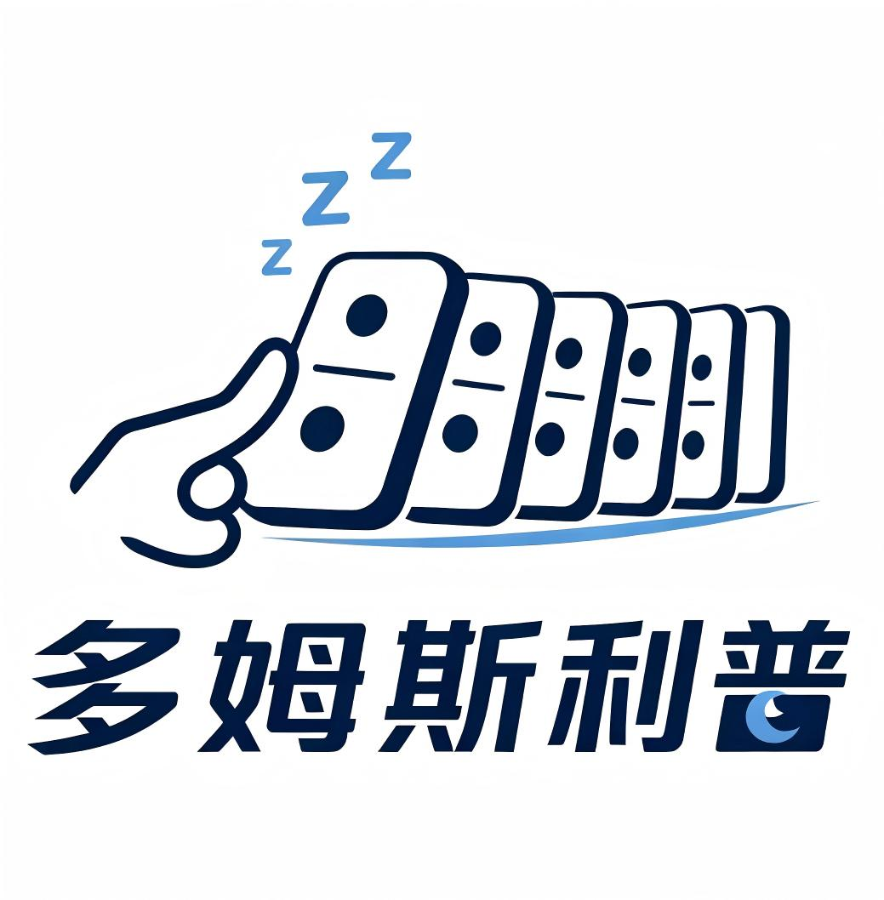
<br/><br/>
<b>产品：眠羊 SleepBaa</b> &nbsp;×&nbsp; <b>团队：多姆斯利普（DormSleep）</b>
<br/>
天津大学 · 多姆斯利普队
</div>

<table width="100%" style="width: 100%;">
  <thead>
    <tr>
      <th width="40%">成员（GitHub）</th>
      <th width="60%">分工</th>
    </tr>
  </thead>
  <tbody>
    <tr>
      <td><a href="https://github.com/zhiwuyazhe-fjr">@zhiwuyazhe-fjr</a></td>
      <td>产品经理 / 后端负责人</td>
    </tr>
    <tr>
      <td><a href="https://github.com/GlacierXiaowei">@GlacierXiaowei</a></td>
      <td>UI 设计 / 交互设计 / 前端负责人</td>
    </tr>
    <tr>
      <td><a href="https://github.com/leqi-chen">@leqi-chen</a></td>
      <td>前端开发 / 创意策划</td>
    </tr>
    <tr>
      <td><a href="https://github.com/Felix-dp">@Felix-dp</a></td>
      <td>后端开发 / AI 集成</td>
    </tr>
  </tbody>
</table>

---

<a id="license"></a>

## 📜 开源协议

> [!IMPORTANT]
> **本仓库不是宽松开源协议项目，请务必仔细阅读以下条款。**

本项目采用 **[《眠羊 SleepBaa 非商业使用许可协议（SBNC-1.0）》](LICENSE)**，核心条款：

- ✅ **允许**：个人学习、研究、非商业性质的教学与学术交流；
- ❌ **严禁商用**：严禁将本作品的全部或任何部分用于**任何形式的商业目的或商业场景**——包括但不限于出售、转售、集成进商业产品、提供付费/SaaS 服务、广告变现、企业内部使用等；
- ❌ **严禁**删除或篡改版权声明与署名信息；
- 📌 再分发与衍生作品必须保留本协议并显著署名「眠羊 SleepBaa —— 天津大学 多姆斯利普团队」；
- ⚖️ 未经授权的商业使用将导致授权自动终止，团队保留依法追究法律责任的一切权利；
- 💼 如需**商业授权**，请通过本仓库 Issues 与团队联系。

本仓库中的「眠羊 SleepBaa」名称、产品 Logo、团队 Logo、宣传视频及相关品牌素材的权益均归团队所有，不在开源授权范围内。

---

<div align="center">

**愿每一个夜晚，都被温柔接住。** 🌙

*Sleep Baa — because counting sheep is so last dorm.*

<sub>© 2026 天津大学 多姆斯利普团队 · 保留所有权利</sub>

</div>
